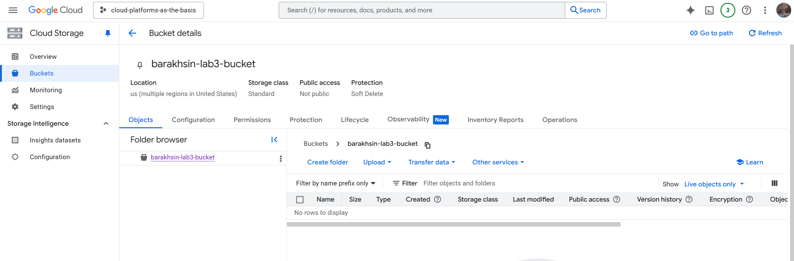
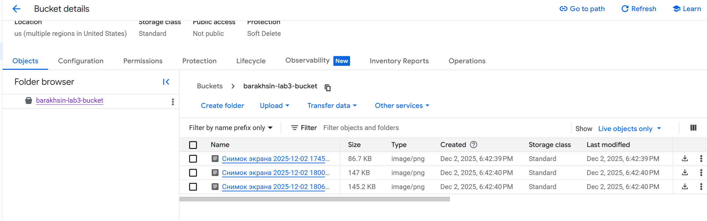
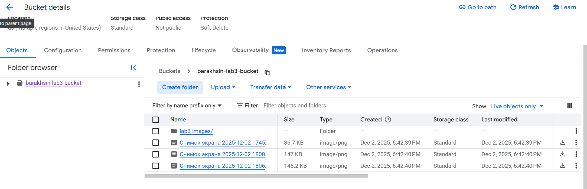
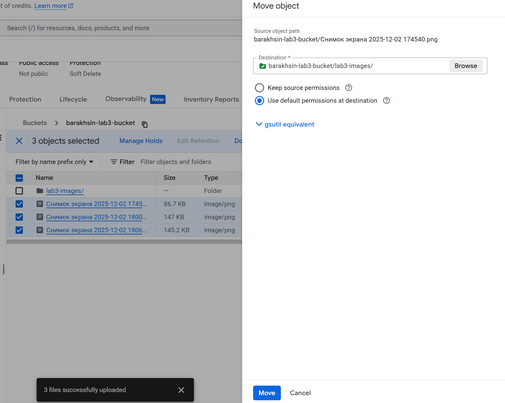
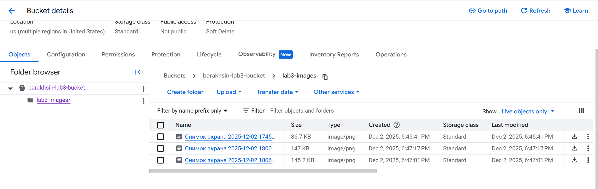
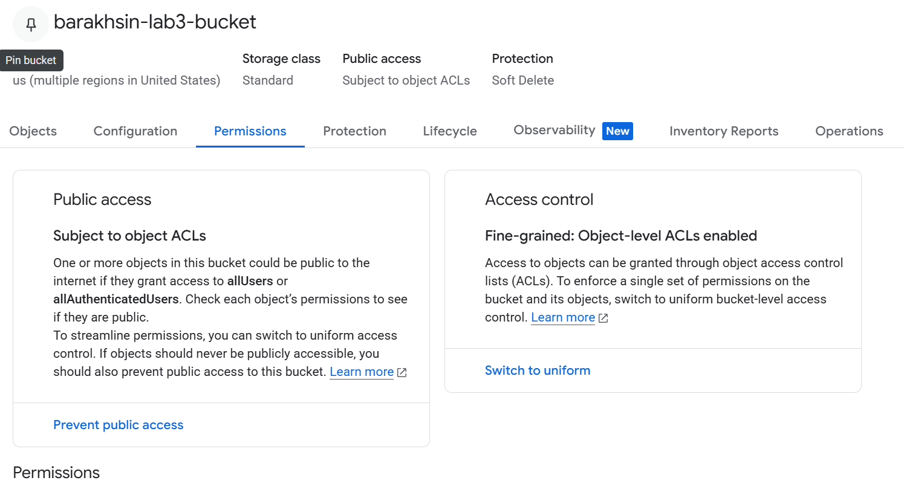
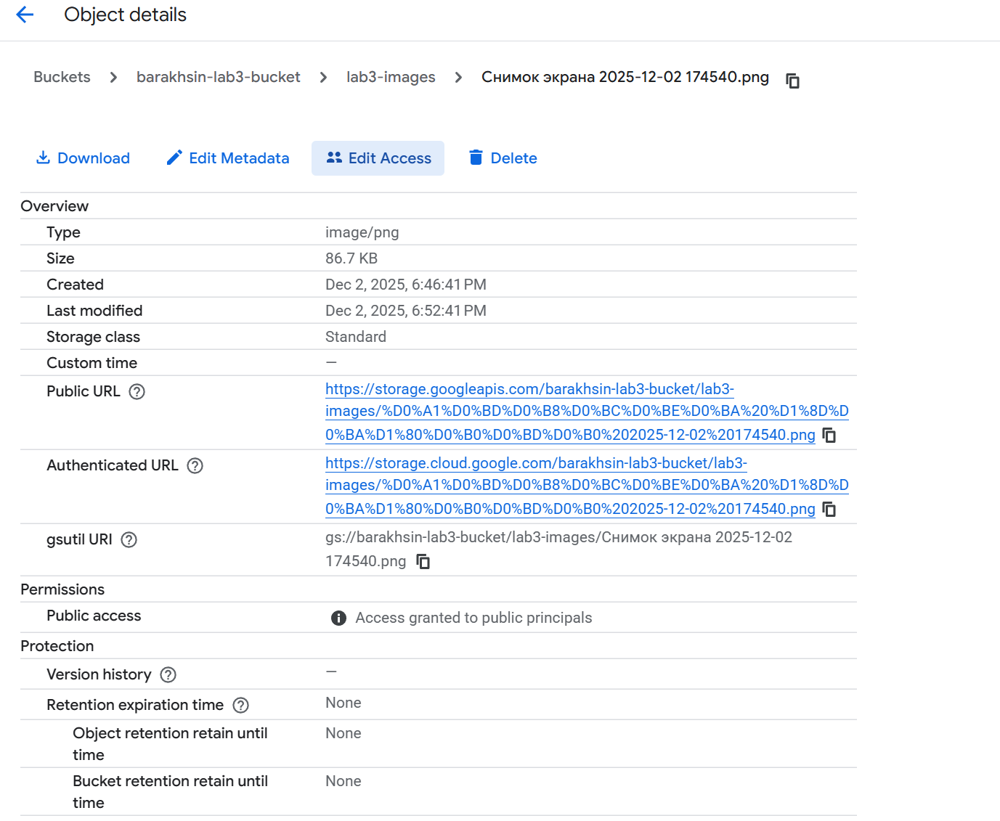
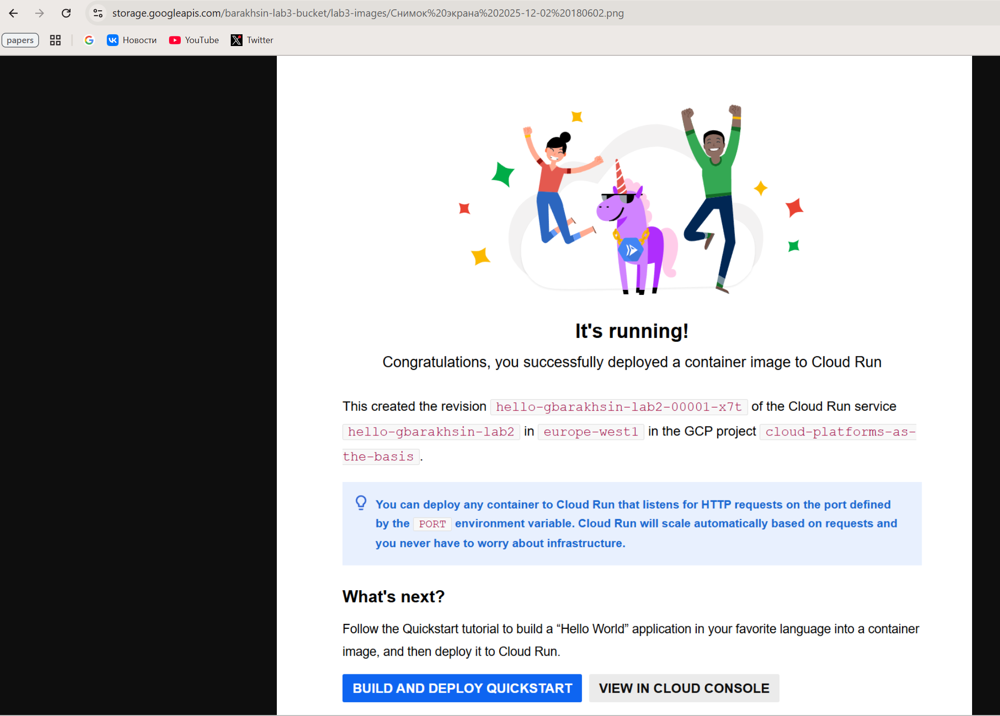

# Отчет по лабораторной №3

University: [ITMO University](https://itmo.ru/ru/)\
Faculty: FTMI\
Course: [Cloud platforms as the basis of technology entrepreneurship](https://itmo-ict-faculty.github.io/cloud-platforms-as-the-basis-of-technology-entrepreneurship/)\
Year: 2025/2026\
Group: U4225\
Author: Barakhsin Grigorii Mikhailovich\
Lab: Lab3\
Date of create: 02.12.2025\
Date of finished: 02.12.2025

**Ход работы**

### 1. Создание бакета Cloud Storage

В консоли Google Cloud открыл раздел Cloud Storage (Buckets) и создал новый бакет  
`barakhsin-lab3-bucket` со стандартными настройками/

На скрине видно пустой бакет сразу после создания (внизу всплывающее сообщение).

### 2. Загрузка изображений в бакет

Через кнопку Upload files загрузил в корень бакета три тестовых изображения  
`Снимок экрана ...`.

На скрине видно список объектов в бакете: все три файла лежат в корне.

### 3. Создание папки для изображений

Для организации структуры создал в бакете папку lab3-images. На скрине видно, что в корне бакета теперь есть папка и загруженные ранее файлы.

### 4. Перемещение/организация файлов в папке lab3-images

Переместил изображения в папку lab3-images

### 5. Настройка публичного доступа и получение Public URL

Для файла `s_1.png` открыл страницу Object details.  
Сделал следующие действия:

- выключил блокировку Public Access Prevention для бакета;  
- настроил object-level ACL так, чтобы объект был доступен публично;  
- выдал доступ публичным принципалам.

### 6. Проверка открытия изображения по публичной ссылке

Скопировал Public URL и открыл его в браузере
https://storage.googleapis.com/barakhsin-lab3-bucket/lab3-images/%D0%A1%D0%BD%D0%B8%D0%BC%D0%BE%D0%BA%20%D1%8D%D0%BA%D1%80%D0%B0%D0%BD%D0%B0%202025-12-02%20180602.png успешно отображается загруженное изображение (скрин тестирования Cloud Run). Это подтверждает корректную настройку публичного доступа к объекту в Cloud Storage.

## Результаты работы

В ходе лабораторной работы было выполнено:

- создан бакет barakhsin-lab3-bucket в Google Cloud Storage;
- загружены и организованы изображения в папке `lab3-images`;
- настроен публичный доступ к объектам;
- получены и проверены публичные ссылки на файлы (изображения открываются в браузере).

**Цель лабораторной работы достигнута: на практике отработан базовый цикл работы с объектным хранилищем Google Cloud Storage — от создания бакета до публикации файлов по публичным URL.**