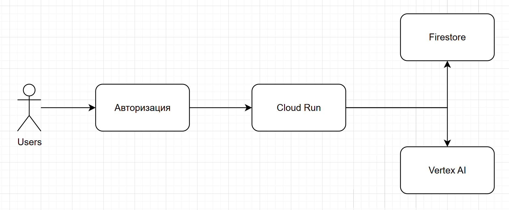
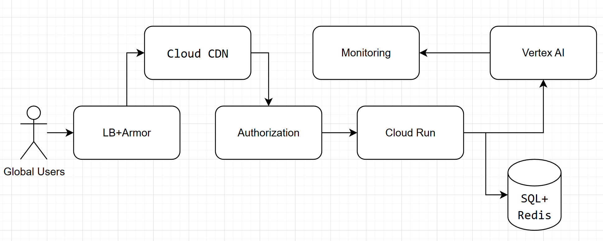

# Отчет по лабораторной №4

University: [ITMO University](https://itmo.ru/ru/)\
Faculty: FTMI\
Course: [Cloud platforms as the basis of technology entrepreneurship](https://itmo-ict-faculty.github.io/cloud-platforms-as-the-basis-of-technology-entrepreneurship/)\
Year: 2025/2026\
Group: U4225\
Author: Barakhsin Grigorii Mikhailovich\
Lab: Lab4\
Date of create: 02.12.2025\
Date of finished: 02.12.2025

## MVP (~10–20 пользователей, $8–15)

- [Firebase Auth] Бесплатная авторизация (email, Google)[web:52]  
- [Cloud Run] Backend с минимальным ресурсом, до 2 инстансов[web:57]
- [Firestore] NoSQL БД о пользователях, бесплатный tier[web:52]
- [Vertex AI Gemini Flash Lite] 10k запросов в месяц, самый базовый AI тариф[web:58]

**Архитектура:**  
Users → Auth → Cloud Run → Firestore / Vertex AI

---

## INTEGRATION TEST (~100–500 пользователей, $100–150)

- [Firebase Auth]  
- [Cloud Endpoints] Дешевый API гейтвей[web:57]
- [Cloud Run] Увеличенные ресурсы, до 10 инстансов[web:57]
- [Cloud SQL] PostgreSQL, малый тариф (10GB)[web:57]
- [Vertex AI Gemini Flash] 100k запросов, стандартный тариф[web:58]

**Архитектура:**  
Partner Users → Endpoints → Auth → Cloud Run → Cloud SQL / Vertex AI

---

## PRODUCTION (~1000–2000 пользователей, ~$1000)

- [Global LB, Cloud Armor] Балансер и DDoS защита[web:57]
- [Firebase Auth/Identity Platform] Enterprise auth[web:52]
- [Cloud Run] Multi-region, много инстансов (до 50)[web:57]
- [Cloud SQL HA, Redis] БД с HA, реплики, MemoryStore для кэша
- [Vertex AI Gemini Flash + Batch] 500k–1M AI-запросов, быстрая инференция[web:58]
- [Cloud CDN/Monitoring] Глобальное ускорение, мониторинг[web:57]

**Архитектура:**  
Global Users → LB+Armor → CDN → Auth → Cloud Run → SQL+Redis / Vertex AI → Monitoring

---

### Цены и переходы

| Этап           | Auth           | Backend        | Storage      | AI / month   | Прочее        | Примерно $ |
| -------------- | -------------- | -------------- | ------------ | ------------ | ------------- | ---------- |
| MVP            | Free           | $3–5           | $0–2         | ~$1          | —             | 4–8        |
| Integration    | Free           | $45            | $30          | ~$36         | $15           | 126        |
| Production     | $20–120        | $350           | $200–250     | ~$340        | $50–100       | 800–1000   |

**Выбор ресурсов обоснован скоростью развития: дешевый старт, лёгкая миграция в прод — без переписывания архитектуры.**
